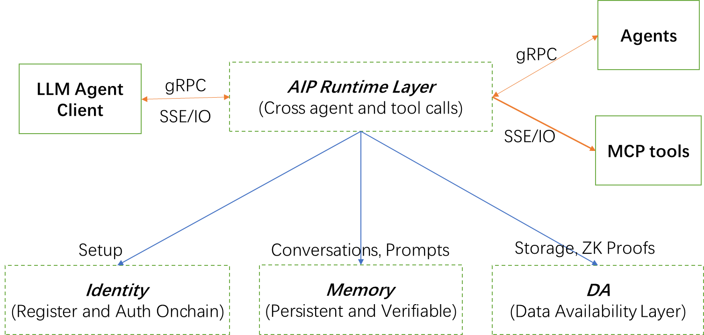

# AIP Whitepaper

* [Whitepaper Full Version](https://github.com/unibaseio/aip-agent/blob/main/whitepaper/AIP_whitepaper_en.md)

### 1. Introduction

🔗 _**Building the Open Agent Internet.**_

**AIP (Agent Interoperability Protocol)** is the first Web3-native interoperability protocol for AI agents — enabling on-chain identity, persistent memory, and cross-platform coordination. It addresses the core infrastructure gap for autonomous AI in Web3.

***

### 2. Why AIP?

#### 🔥 Problems in Existing Systems

* ❌ **Siloed Agents:** Agents can't talk across ecosystems like MCP, A2A, LangChain.
* ❌ **No Unified Identity:** No verifiable way to track or authorize agents across chains/tools.
* ❌ **Stateless Behavior:** Agents forget everything — no continuity, learning, or evolution.

#### ✅ AIP Offers

* 🌐 **Cross-agent & tool communication** via gRPC + MCP-compatible interface
* 🧠 **Persistent memory** stored in Membase with onchain proof
* 🆔 **Verifiable onchain identity** + permission control
* 🔗 **Composable workflows** across LLMs, tools, and agents

***

### 3. Protocol Comparison

| Feature                       | **MCP** (Anthropic)         | **A2A** (Google)             | **AIP** (Unibase) 🚀                      |
| ----------------------------- | --------------------------- | ---------------------------- | ----------------------------------------- |
| **Primary Focus**             | LLM & tool/data integration | Agent-to-agent communication | Full agent interoperability + tool access |
| **Cross-Agent Communication** | ❌                           | ✅                            | ✅                                         |
| **Tool Integration**          | ✅                           | ❌                            | ✅                                         |
| **Built-in Memory Support**   | ❌                           | ❌                            | ✅ (via Membase)                           |
| **On-Chain Identity & Auth**  | ❌                           | ❌                            | ✅ (via ZK + blockchain)                   |
| **Agent/Tool Discovery**      | ✅                           | ❌                            | ✅ (built-in discovery & registry)         |
| **Protocol Compatibility**    | MCP only                    | A2A only                     | ✅ (MCP + gRPC compatible)                 |
| **Decentralization**          | ❌                           | ❌                            | ✅ (Web3-native)                           |

AIP is the first full-stack agent interoperability standard that bridges decentralized identity, memory, and messaging across agents and platforms.

***

### 4. Architecture

#### 📐 AIP Protocol Architecture Diagram

<figure><figcaption></figcaption></figure>

AIP consists of **four modular layers**, enabling verifiable identity, real-time communication, decentralized memory, and ZK-verified data availability for AI agents.

#### 🧱 Identity Layer

Smart contracts manage agent registration and permission control, ensuring each agent has a unique and verifiable onchain identity.

#### 🔗 Communication Layer (AIP Runtime)

A lightweight, MCP + gRPC-compatible runtime that enables cross-agent communication, agent-tool function calls, and workflow coordination.

#### 🧠 Memory Layer (Membase)

Agents use Membase to store long-term memory including dialogue history, prompts, and knowledge bases — providing persistent and evolvable agent context.

#### ⚙️ Data Availability Layer (Unibase DA)

A high-throughput, ZK-verified storage layer that ensures real-time data access and onchain auditability for agent memory and task logs.

***

### 5. Agent Interaction Process

Agent-to-Agent

<figure><figcaption></figcaption></figure>

Agent Collaboration

<figure><figcaption></figcaption></figure>

***

### 6. Use Cases

#### 🤖 Autonomous DeFi Agents

Agents coordinate strategies, rebalance portfolios, or automate trades using AIP + Membase memory.

#### 🎮 Multi-Agent Gaming

Agents interact in real-time multiplayer simulations or strategic competitions, sharing memory and roles.

#### 🧠 Knowledge Mining & Sharing

Agents can access, refine, and contribute to decentralized knowledge networks (e.g. distributed AI memory graphs).

#### 🛰️ Cross-Platform Tooling

LLMs and tools running on different chains/environments can collaborate via AIP with shared permission logic and memory.

***

### 7. Governance

AIP protocol evolution will be governed by the Unibase ecosystem through **veToken staking**.

* 🗳 Community proposals & upgrades
* ⚙️ Parameter tuning (e.g. rate limits, protocol fees)
* 🧩 Feature roadmap voting (e.g. agent discovery, agent marketplaces)
* 💰 Treasury allocation for ecosystem devs

Governance will be progressively decentralized.

***

### 8. Security & Verifiability

#### 🔐 Identity & Auth

* Onchain registration and verifiable agent keys via EVM contracts
* zkAuth planned for lightweight privacy-preserving permissioning

#### 🧠 Memory Integrity

* All memory updates cryptographically committed to Unibase DA
* Agents can use proof-backed memory for audits, compliance, or dispute resolution

#### 🚨 Attack Mitigation

* Access control policies built into AIP registry layer
* Optional rate limits, allowlists, and fraud reporting

***

### 9. Developer Resources

* 📦 SDK: [https://github.com/unibaseio/aip-agent](https://github.com/unibaseio/aip-agent)
* 📚 Docs: [https://openos-labs.gitbook.io/unibase-docs](https://openos-labs.gitbook.io/unibase-docs)
* 🧪 Platform: [https://www.bitagent.io](https://www.bitagent.io/)
* 🧪Explorer: [https://www.explorer.unibase.com](https://www.explorer.unibase.com/)
* 📬 Telegram: [https://t.me/unibase\_ai](https://t.me/unibase_ai)
* 🐦 Twitter: [https://twitter.com/Unibase\_AI](https://twitter.com/Unibase_AI)

***

### 10. Roadmap

| Milestone                        | Timeline | Status     |
| -------------------------------- | -------- | ---------- |
| Agent Identity Registry          | Q4 2024  | ✅ Complete |
| Membase + Unibase DA Integration | Q4 2024  | ✅ Complete |
| MCP / gRPC Compatibility         | Q1 2025  | ✅ Complete |
| Agent Discovery & Registry       | Q1 2025  | ✅ Complete |
| AIP Governance                   | Q3 2025  | 🔜 Planned |
| Cross-chain AIP Deployments      | Q1 2026  | 🔜 Planned |

