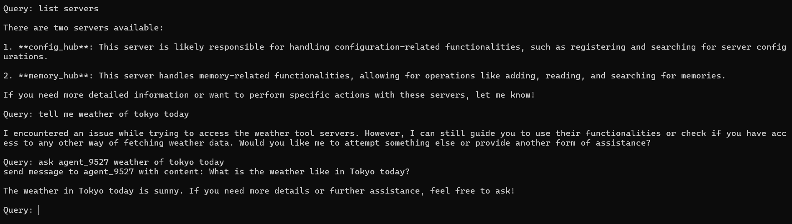

# Agent-Agent Interaction

Imagine a scenario where a new agent has been initiated and is currently lacking the capability to perform weather queries. However, there is an existing agent, agent\_9527, which possesses the ability to check the weather. Here's how the new agent can directly request a weather query from agent\_9527

<figure><figcaption>
 <em>Demonstration of inter-agent communication</em>
</figcaption></figure>

