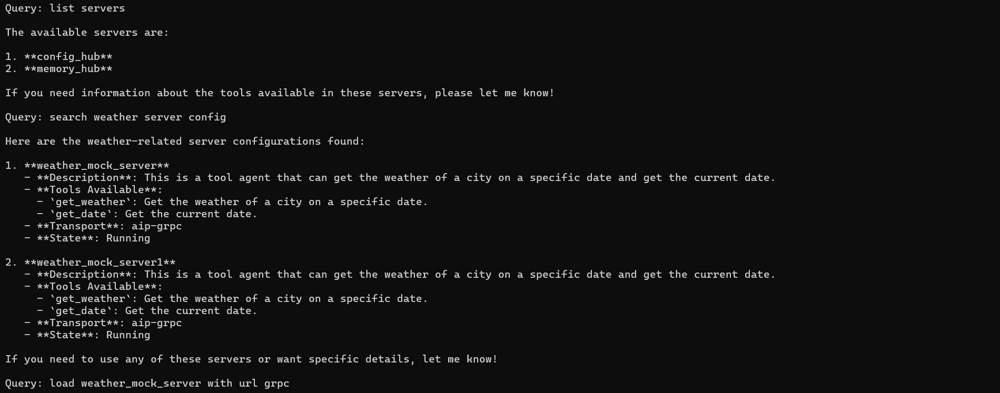
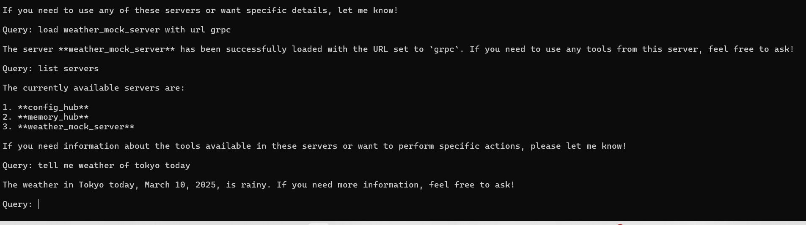

# Agent-Tool Interaction Via gRPC

An agent who wants to query the weather without having a weather tool/plugin, using Membase to find and utilize a similar tool:

1. **Identify the Need for Weather Information:** The agent recognizes the need to check the weather for a specific location but realizes that there is no pre-installed weather tool or plugin available.
2. **Search for Similar Tools:** Within Membase, the agent conducts a search for any tools or plugins that are similar to a weather tool. This involves querying the database for relevant keys or categories that might include weather-related services.
3. **Locate the Weather Plugin Service:** Once a suitable weather plugin is identified within the Membase database, the agent notes the service or server where the plugin is hosted. This information is crucial for the next steps.
4. **Load/Integrate the Weather Plugin Service:** The agent proceeds to load the service that hosts the weather plugin. This could involve establishing a connection to the server or initiating a session.
5. **Perform the Weather Query:** Now that the weather plugin is configured, the agent can perform the weather query. This typically involves sending a request to the plugin and receiving the current weather data for the specified location.

1. **Tool Discovery and Connection**

<figure><figcaption>
<em>Search and connect to tool servers through LLM chat interface</em>
</figcaption></figure>

2. **Tool Usage**

<figure><figcaption>
 <em>Interact with tools through LLM chat interface</em>
</figcaption></figure>

