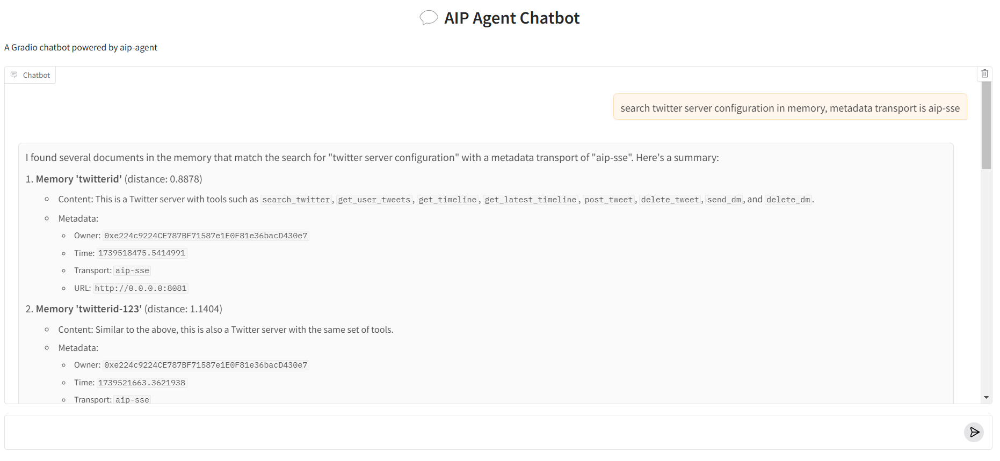
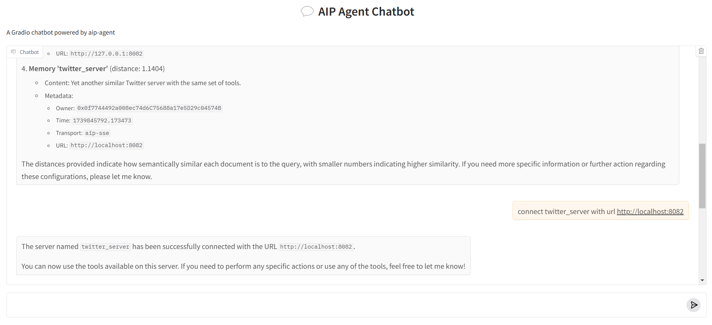
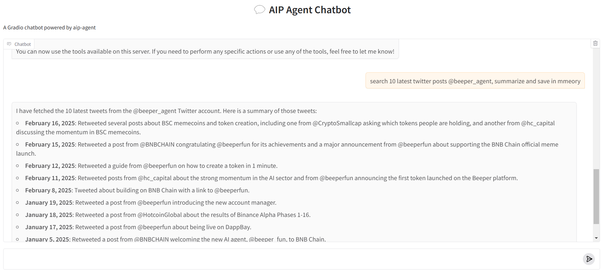

# Agent-Tool Interaction Via SSE

Simlarity to grpc tool discovery, the diference is using aip-sse protocol to connect sse tool

1. **Tool Discovery**

<figure><figcaption></figcaption></figure>

2. **Tool connect**

<figure><figcaption></figcaption></figure>

3. **Tool use**

<figure><figcaption></figcaption></figure>
