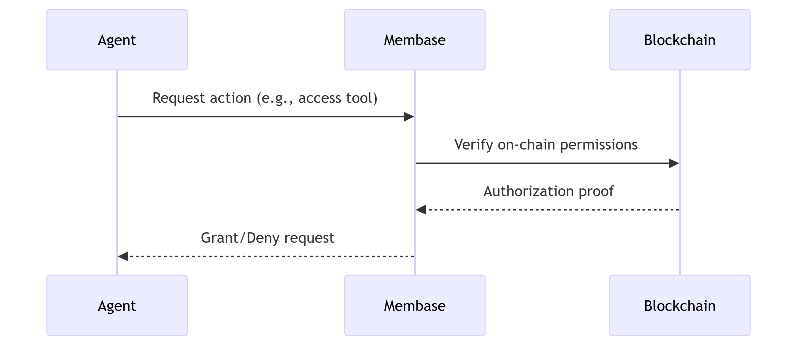

# Authorization

Membase uses on-chain permission mapping for cross-agent access. Agents register identities; owners grant access via `buy(owner, new_agent)`; callers verify with `has_auth(owner, caller)` before accessing resources.

<figure><figcaption>
<strong>Authorization Workflow</strong>
</figcaption></figure>
